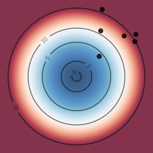
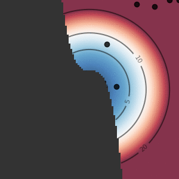

# sparkle

<p align="center">
  
</p>

`sparkle` is a parametric, gradient-free optimization library that I mostly developed at CEMEF, in the CFL group (public repo from the team is <a href="https://git.sophia.minesparis.psl.eu/paul.garnier/sparkle">here</a>). It is designed to provide a common interface to various algorithms, and to make numerical experimentation easy.

If you end up using this library for research purpose, please consider citing the following paper (<a href="https://arxiv.org/pdf/2506.13240">link</a>):

```
Mixed-variable policy-based optimization
J. Viquerat
arXiv pre-print 2506.13240, 2025
```

</br>

## Installation and usage

Clone this repository and install it locally. We recommend to use `uv`:

```
git clone git@github.com:jviquerat/sparkle.git
cd sparkle
uv venv
source .venv/bin/activate
uv pip install -r pyproject.toml
uv pip install -e .
```

Environments are expected to be available locally or present in the path. To train an agent on an environment, a `.json` case file is required (sample files are available in `sparkle/env`). Once you have written the corresponding `<env_name>.json` file to configure your agent, just run:

```
spk --train <json_file>
```

## Analytical environments

| Environment  | Default dimension | Description                                                            | Illustration                                                       |
|:-------------|:------------------|:-----------------------------------------------------------------------|:------------------------------------------------------------------:|
| `parabola`   | 2                 | Classic parabola (solved with `PBO`)                                   |      |
| `rosenbrock` | 2                 | Rosenbrock function (solved with `CMAES`)                              |  |
| `multi1d`    | 1                 | Multi1D function (solved with `EGO`)                                   |       |
| `constraint` | 2                 | Parabola with a priori constraints on parameters (solved with `CMAES`) |  |

## Physics-based environments

| Environment   | Default dimension | Description                                                                                                                                                                                                                                                | Illustration                                                        |
|:--------------|:------------------|:-----------------------------------------------------------------------------------------------------------------------------------------------------------------------------------------------------------------------------------------------------------|:-------------------------------------------------------------------:|
| `lorenz`      | 4                 | Optimizing a control law for the chaotic Lorenz attractor, adapted from <a href="https://www.tandfonline.com/doi/full/10.1080/14685248.2020.1797059">this ref</a> (solved with `PBO`)                                                                      |         |
| `n-body`      | 9                 | Optimizing the initial parameters to find periodic orbits, adapted from <a href="https://pubs.aip.org/aapt/ajp/article-abstract/82/6/609/1057817/A-guide-to-hunting-periodic-three-body-orbits?redirectedFrom=fulltext">this ref</a> (solved with `CMAES`) |        |
| `heat-source` | 14                | Optimizing the positions of heat sources to obtain a high temperature distribution with low variance in a target area (solved with `CMAES`)                                                                                                                |  |
| `packing`     | 26                | Finding the best disk packing within a square domain, adapted from <a href="https://erich-friedman.github.io/packing/index.html">this ref</a> (solved with `PBO`)                                                                                          |        |
| `emstack`     | 40                | Optimizing the reflectance of a dielectric mirror with mixed continuous/discrete variables (solved with `PBO`)                                                                                                                                             |        |

