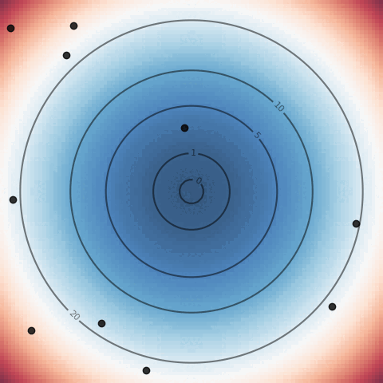
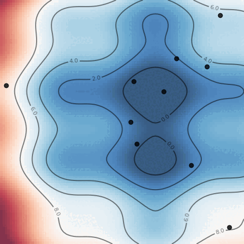
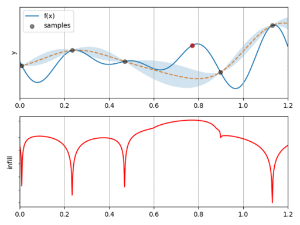

# sparkle

<p align="center">
  
</p>


`sparkle` is a parametric, gradient-free optimization library. It is designed to provide a common interface to various algorithms, and to make numerical experimentation easy.

Implementation of the following algorithms is planned:

- Particle swarm optimization (PSO)
- Cross-entropy method (CEM)
- Covariance matrix adaptation evolution strategy (CMAES)
- Efficient global optimization (EGO)
- Policy based optimization (PBO)

More informations about each method can be obtained from the documentation. 

## Installation and usage

Clone this repository and install it locally:

```
git clone git@github.com:jviquerat/sparkle.git
cd sparkle
pip install -e .
```

Environments are expected to be available locally or present in the path. To train an agent on an environment, a `.json` case file is required (sample files are available in `sparkle/env`). Once you have written the corresponding `<env_name>.json` file to configure your agent, just run:

```
spk --train <json_file>
```

## Analytical environments

| Environment  | Default dimension | Description                               | Illustration                                                       |
|:-------------|:------------------|:------------------------------------------|:------------------------------------------------------------------:|
| `parabola`   | 2                 | Classic parabola (solved with `CEM`)      |      |
| `rosenbrock` | 2                 | Rosenbrock function (solved with `CMAES`) |  |
| `sinebump`   | 2                 | Sinebump function (solved with `PSO`)     |      |
| `multi1d`    | 1                 | Multi1D function (solved with `EGO`)      |       |

## Physics-based environments

| Environment   | Default dimension | Description                                                                                                                                                                                                                                                | Illustration                                                        |
|:--------------|:------------------|:-----------------------------------------------------------------------------------------------------------------------------------------------------------------------------------------------------------------------------------------------------------|:-------------------------------------------------------------------:|
| `lorenz`      | 4                 | Optimizing a control law for the chaotic Lorenz attractor (solved with `PBO`)                                                                                                                                                                              |         |
| `n-body`      | 9                 | Optimizing the initial parameters to find periodic orbits, adapted from <a href="https://pubs.aip.org/aapt/ajp/article-abstract/82/6/609/1057817/A-guide-to-hunting-periodic-three-body-orbits?redirectedFrom=fulltext">this ref</a> (solved with `CMAES`) |        |
| `heat-source` | 14                | Optimizing the positions of heat sources to obtain a high temperature distribution with low variance in a target area (solved with `CMAES`)                                                                                                                |  |
| `packing`     | 26                | Finding the best disk packing within a square domain (solved with `PBO`)                                                                                                                                                                                   |  |

