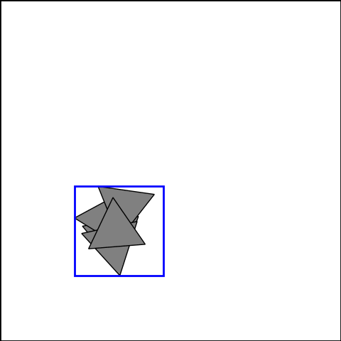

# sparkle

<p align="center">
  
</p>


`sparkle` is a parametric, gradient-free optimization library. It is designed to provide a common interface to various algorithms, and to make numerical experimentation easy.

Implementation of the following algorithms is planned:

- Particle swarm optimization (PSO)
- Cross-entropy method (CEM)
- Covariance matrix adaptation evolution strategy (CMAES)
- Efficient global optimization (EGO)
- Policy based optimization (PBO)

More informations about each method can be obtained from the documentation. 

## Installation and usage

Clone this repository and install it locally:

```
git clone git@github.com:jviquerat/sparkle.git
cd sparkle
pip install -e .
```

Environments are expected to be available locally or present in the path. To train an agent on an environment, a `.json` case file is required (sample files are available in `sparkle/env`). Once you have written the corresponding `<env_name>.json` file to configure your agent, just run:

```
spk --train <json_file>
```

## Examples

Below are several optimization examples performed with the different methods.

| **`parabola (cem)`**                                                     | **`rosenbrock (cmaes)`**                                            | **`sinebump (pso)`**                                                       |
| :----------------------------------------------------------------------: | :-----------------------------------------------------------------: | :------------------------------------------------------------------------: |
|           |  |             |
| **`packing (cmaes)`**                                                    | **`lorenz (pbo)`**                                                  | **`packing (cmaes)`**                                                      |
|  |        |  |
