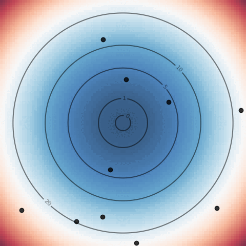

# sparkle

  

`sparkle` is a parametric optimization library. It is designed to provide a common interface to various algorithms, and to make numerical experimentation easy.

## Particle swarm

| **`parabola`**                                                   | **`rosenbrock`**                                                   | **`sinebump`**                                                   |
| :--------------------------------------------------------------: | :----------------------------------------------------------------: | :--------------------------------------------------------------: |
|  |  |  |
