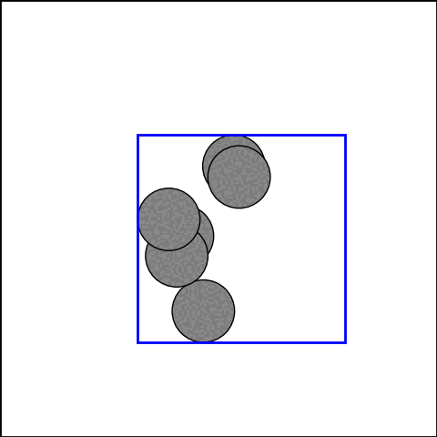

# sparkle

  

`sparkle` is a parametric, gradient-free optimization library. It is designed to provide a common interface to various algorithms, and to make numerical experimentation easy.

Implementation of the following algorithms is planned:

- Particle swarm optimization (PSO)
- Covariance matrix adaptation evolution strategy (CMAES)
- Efficient global optimization (EGO)
- Policy based optimization (PBO)

More informations about each method can be obtained from the documentation. Below are several optimization examples performed with the different methods.

| **`parabola (pso)`**                                                      | **`rosenbrock (cmaes)`**                                             | **`sinebump (pso)`**                                             |
| :-----------------------------------------------------------------------: | :------------------------------------------------------------------: | :--------------------------------------------------------------: |
|           |  |  |
| **`packing (cmaes)`**                                                     | **`?`**                                                              | **`?`**                                                          |
|  |               |           |
